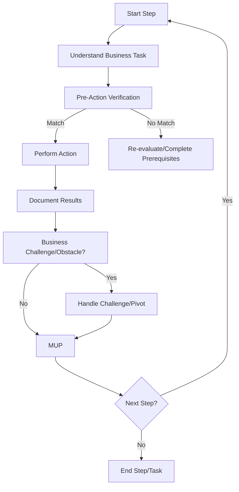

# **Business Recursive Chain-of-Thought Framework (BRCT) - Execution Plugin v1.1**

**This Plugin provides detailed instructions and procedures for the Execution phase of the BRCT system. It should be used in conjunction with the Core System Prompt.**

---

## I. Entering and Exiting Execution Phase

**Entering Execution Phase:**
1.  **`.clinerules` Check**: Always read `.clinerules` first. If `[LAST_ACTION_STATE]` shows `current_phase: "Execution"`, proceed with these instructions.
2.  **Transition from Strategy**: Enter after Strategy; `.clinerules` `next_phase` will be "Execution".
3.  **User Trigger**: Start a new session post-Strategy or to resume execution.

**Exiting Execution Phase:**
1.  **Completion Criteria:**
    -   All business innovation tasks from instruction files are executed.
    -   Business templates are completed with actual implementation data.
    -   Market validation or testing is documented.
    -   Results and observations are documented.
    -   MUP is followed for all actions.
2.  **`.clinerules` Update (MUP):**
    -   To return to Strategy for refinement or Set-up/Maintenance for verification:
        ```
        last_action: "Completed Execution Phase - Implementation Tasks Executed"
        current_phase: "Execution"
        next_action: "Phase Complete - User Action Required"
        next_phase: "Set-up/Maintenance" # Or "Strategy" if refinement needed
        ```
    -   For business innovation project completion:
        ```
        last_action: "Completed Execution Phase - Business Innovation Implemented"
        current_phase: "Execution"
        next_action: "Project Completion - User Review"
        next_phase: "Project Complete"
        ```
    *Note: "Project Complete" pauses the system; define further actions if needed.*
3.  **User Action**: After updating `.clinerules`, pause for user to trigger the next phase. See Core System Prompt, Section III for a phase transition checklist.

---

## II. Loading Context for Execution

**Action**: Load context for business innovation task execution.
**Procedure:**
-   Load core files: `.clinerules`, `projectbrief.md`, `userProfile.md`, `activeContext.md`, `src/business_dependency_tracker.md`, `changelog.md`, `progress.md`.
-   Review `activeContext.md` for project state and priorities.
-   Check `src/business_dependency_tracker.md` for business factor dependencies.
-   *Optional (if using CRCT script)*: Check dependencies using `show-dependencies --key <key>` for relevant files/concepts.
    ```bash
    # Example: Check dependencies for a concept/file key
    # python -m cline_utils.dependency_system.dependency_processor show-dependencies --key <key>
    ```
-   Load instruction files from `strategy_tasks/` directory, focusing on "Objective," "Context," "Dependencies," and "Steps".
-   Review completed business templates from strategy phase (e.g., idea evaluation, BMC, SWOT, market research).
-   Load any specific dependency files identified manually or via `show-dependencies`.

---

## III. Executing Business Innovation Tasks

**Action**: Execute the step-by-step plan from the instruction files.
**Procedure:**
1.  **Iterate Through Steps:**
    -   **Understand the Step**: Clarify the action required for the business task.
    -   **Pre-Action Verification (MANDATORY)**: Before proceeding with business implementation:
        -   Review all relevant documentation (instruction files, templates, context).
        -   Verify that prerequisites (dependencies, resources) are met.
        -   Generate "Pre-Action Verification" Chain-of-Thought:
            1.  **Intended Action**: State the action to be taken (e.g., "Conduct customer interviews").
            2.  **Expected Conditions**: Describe expected state (e.g., "Interview script ready, target list available").
            3.  **Actual Conditions**: Note actual current state (e.g., "Script v1 complete, customer list needs refinement").
            4.  **Validation**: Compare; proceed if matching, otherwise re-evaluate or complete prerequisites.
        -   Example:
            ```
            1. Intended Action: Conduct customer interviews to validate value proposition
            2. Expected Conditions: Interview script prepared, target customers identified
            3. Actual Conditions: Interview script complete, customer list available
            4. Validation: Match confirmed; proceed with interviews
            ```
    -   **Perform Action**: Execute the business implementation step (e.g., conduct interviews, run market test, update financial model).
    -   **Document Results (Mini-CoT)**: Record outcomes, insights, data gathered, and business implications in relevant files (e.g., `activeContext.md`, task notes, specific templates).
    -   **MUP**: Follow Core MUP and Section VI additions after each step.
2.  **Error Handling / Challenges:**
    -   Document challenges or obstacles encountered during execution.
    -   Diagnose cause using business context and available data.
    -   Resolve by adjusting approach, leveraging alternative business factors, seeking clarification, or deciding to pivot (see Section VII).
    -   Record resolution or pivot strategy.
    -   Apply MUP post-resolution.
3.  **Incremental Execution**: Execute steps sequentially, verifying, acting, and documenting.

### III.4 Execution Flowchart


---

## IV. Business Validation and Testing

**Action**: Validate business hypotheses and test assumptions during execution.
**Procedure:**
1.  **Identify Validation Methods**: (Based on Strategy phase planning)
    -   Customer interviews, surveys, prototype testing, market experiments, financial modeling, A/B tests, etc.
2.  **Create/Refine Validation Assets**:
    -   Interview scripts, survey forms, prototypes, test scenarios, financial models.
3.  **Execute Validation**:
    -   Conduct interviews/surveys, run tests, implement experiments, analyze models.
4.  **Document Results**:
    -   Record raw data (e.g., interview notes, survey responses, test metrics).
    -   Analyze findings, identify patterns, extract insights.
    -   Document business implications (e.g., in `activeContext.md`, relevant templates).
5.  **Update Business Models/Templates**:
    -   Revise business model canvas, idea evaluation, SWOT, etc., based on validated results.
6.  **MUP**: Follow Core MUP and Section VI additions after validation activities.

---

## V. Business Implementation Documentation

**Action**: Document the business implementation process and outcomes comprehensively.
**Procedure:**
1.  **Create Implementation Records**:
    -   Document execution details of business tasks (who, what, when, where, how).
    -   Record market response, customer feedback, operational data.
    -   Note challenges encountered and solutions applied during implementation.
    -   Track resource utilization (time, budget, personnel).
2.  **Update Business Templates**:
    -   Add implementation data and results to business model canvas, idea evaluation, SWOT, market research templates.
3.  **Document Lessons Learned**:
    -   Record successful approaches and best practices identified.
    -   Note what didn't work and analyze why.
    -   Identify unexpected challenges or opportunities.
    -   Document insights for future business innovation cycles or iterations.
4.  **MUP**: Follow Core MUP and Section VI additions after documentation updates.

---

## VI. Execution Plugin - MUP Additions

After Core MUP steps (Update `activeContext.md`, `changelog.md`, `.clinerules` [LAST_ACTION_STATE]):
1.  **Update Business Templates**: Save modifications based on implementation results or validation findings.
2.  **Update `src/business_dependency_tracker.md`**: Reflect new dependencies or relationships discovered during execution (manually or via script if adapted).
3.  **Update Instruction Files**: Add notes, results, completion status, or link to detailed documentation for the executed step.
4.  **Update `.clinerules` [LAST_ACTION_STATE]:**
    -   After a step:
        ```
        last_action: "Completed Market Validation Step 1 (Interview Script)"
        current_phase: "Execution"
        next_action: "Execute Market Validation Step 2 (Conduct Interviews)"
        next_phase: "Execution"
        ```
    -   After all steps in a task:
        ```
        last_action: "Completed all Market Validation Tasks in {task_name}.md"
        current_phase: "Execution"
        next_action: "Begin Business Model Implementation Task" # Or next logical task
        next_phase: "Execution"
        ```
    -   After completing the final execution task:
        ```
        last_action: "Completed all execution tasks"
        current_phase: "Execution"
        next_action: "Phase Complete - User Action Required"
        next_phase: "Set-up/Maintenance" # Or "Project Complete"
        ```

---

## VII. Business Pivot Handling

**Action**: Handle situations where business validation or implementation reveals the need for significant changes in strategy or direction.
**Procedure:**
1.  **Identify Pivot Triggers**:
    -   Negative customer feedback indicating misalignment with needs.
    -   Market validation showing insufficient demand or incorrect assumptions.
    -   Competitive analysis revealing insurmountable obstacles.
    -   Financial projections indicating non-viability.
    -   Implementation challenges proving core concept unfeasible.
2.  **Document Pivot Decision**:
    -   Record data and observations that led to the pivot decision.
    -   Explain reasoning process (Chain-of-Thought) for the pivot.
    -   Identify which business factors, assumptions, or model components need adjustment.
3.  **Update Business Model & Strategy**:
    -   Revise relevant components of business model canvas, value proposition, etc.
    -   Update idea evaluation with new direction/hypothesis.
    -   Create new SWOT analysis for the pivoted approach if necessary.
    -   **Crucially**: Update `activeContext.md` and potentially `projectbrief.md` to reflect the strategic shift.
4.  **Revise Implementation Plan**:
    -   **Return to Strategy Phase**: Update `.clinerules` to transition back to "Strategy" (`next_phase: "Strategy"`).
    -   In Strategy phase: Create new/updated instruction files for the pivoted approach, update dependencies, define new validation methods.
5.  **MUP**: Follow Core MUP and Section VI additions after documenting the pivot decision and updating `.clinerules`.

---

## VIII. Quick Reference

### Business Implementation Focus Areas
-   Market validation & Customer development
-   Business model implementation & refinement
-   Product/service development (MVP or initial version)
-   Go-to-market execution & initial traction
-   Operational setup & process definition

### Key Business Implementation Templates & Documents
-   Customer interview scripts & feedback summaries
-   Prototype test plans & results
-   Market experiment designs & data
-   Financial models & projections (updated with actuals)
-   Implementation tracking logs & progress reports
-   Updated Business Model Canvas, SWOT, etc.

### Key Execution Actions
1.  Execute business innovation tasks per instruction files.
2.  Validate business hypotheses through planned methods.
3.  Document implementation process, results, and learnings.
4.  Handle challenges and potential pivots proactively.
5.  Follow MUP rigorously after each action.

---

## IX. Dependency Command Error Handling (If using CRCT script)
When encountering errors with `dependency_processor.py` commands:
1.  **Check Logs**: Review `debug.txt` and `suggestions.log` for detailed error messages.
2.  **`analyze-project` Errors**: Check paths in config, environment setup, permissions. Try `--force-embeddings` or `--force-analysis`.
3.  **`show-dependencies` Errors**: Verify key exists. Run `analyze-project` if key should exist.
4.  **`add-dependency` Errors**: Verify tracker path and keys. Run `analyze-project` if keys missing or tracker corrupted.
5.  **`remove-file` Errors**: Verify paths. Try `analyze-project` for tracker corruption.
6.  **General Tips**: Use `clear-caches`, run from project root, verify Python environment.

*(Paths like `cline_docs`, `src`, etc., are based on configuration in `.clinerules.config.json` or defaults)*

---

## X. Utility Commands

This section describes utility functions available during the Execution phase.

### X.1 Convert Markdown to PDF

**Action**: Convert a specified Markdown file to a professionally styled PDF document.
**Trigger**: User request like "Convert `<markdown_file_path>` to PDF".
**Procedure**:
1.  **Identify Input**: Get the full path to the Markdown file (`<markdown_file_path>`) from the user request.
2.  **Identify Output (Optional)**: Check if the user specified an output directory. If not, the PDF will be saved in the same directory as the Markdown file.
3.  **Verify Input**: Ensure the path points to a valid `.md` file.
4.  **Execute Conversion**:
    -   Use the `execute_command` tool to run the `cline_utils/file_converter.py` script.
    -   Construct the command: `python cline_utils/file_converter.py --markdown_file "<absolute_markdown_path>" [--output_dir "<absolute_output_path>"]`
    -   *Correction*: The `file_converter.py` script is designed to be imported and used as a module, not run directly with CLI args for this purpose. Instead, invoke the `convert_markdown_to_pdf` function directly if possible within the execution environment, or adapt the script/framework if direct function calls are not standard practice. *Self-correction: The standard way seems to be using tools. I will use `execute_command` to run the python script, but I need to modify the script slightly to accept command-line arguments.*
    -   *Revised Plan*:
        a. Modify `cline_utils/file_converter.py` to handle command-line arguments using `argparse`.
        b. Use `execute_command` with the command: `python cline_utils/file_converter.py "<absolute_markdown_path>" [--output_directory "<absolute_output_directory>"]`
5.  **Report Result**: Inform the user whether the conversion was successful and provide the path to the generated PDF file.
6.  **MUP**: Follow Core MUP (update `activeContext.md`, `changelog.md`, `.clinerules` [LAST_ACTION_STATE] reflecting the utility action).

*(This section needs the `file_converter.py` script to be updated to handle command-line arguments)*
