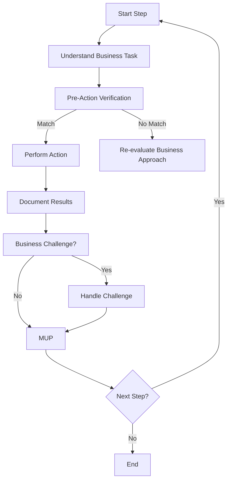

# **Business Recursive Chain-of-Thought Framework (BRCT) - Execution Plugin**

**This Plugin provides detailed instructions and procedures for the Execution phase of the BRCT system. It should be used in conjunction with the Core System Prompt.**

---

## I. Entering and Exiting Execution Phase

**Entering Execution Phase:**
1. **`.clinerules` Check**: Always read `.clinerules` first. If `[LAST_ACTION_STATE]` shows `current_phase: "Execution"`, proceed with these instructions.
2. **Transition from Strategy**: Enter after Strategy; `.clinerules` `next_phase` will be "Execution".
3. **User Trigger**: Start a new session post-Strategy or to resume execution.

**Exiting Execution Phase:**
1. **Completion Criteria:**
   - All business innovation tasks from instruction files are executed
   - Business templates are completed with actual implementation data
   - Market validation or testing is documented
   - Results and observations are documented
   - MUP is followed for all actions
2. **`.clinerules` Update (MUP):**
   - To return to Strategy for refinement:
     ```
     last_action: "Completed Execution Phase - Implementation Tasks Executed"
     current_phase: "Execution"
     next_action: "Phase Complete - User Action Required"
     next_phase: "Strategy"
     ```
   - For business innovation project completion:
     ```
     last_action: "Completed Execution Phase - Business Innovation Implemented"
     current_phase: "Execution"
     next_action: "Project Completion - User Review"
     next_phase: "Project Complete"
     ```
   *Note: "Project Complete" pauses the system; define further actions if needed.*
3. **User Action**: After updating `.clinerules`, pause for user to trigger the next phase. See Core System Prompt, Section III for a phase transition checklist.

---

## II. Loading Context for Execution

**Action**: Load context for business innovation task execution.
**Procedure:**
- Load core files: `.clinerules`, `projectbrief.md`, `productContext.md`, `activeContext.md`, `business_dependency_tracker.md`, `changelog.md`, `progress.md`.
- Review `activeContext.md` for project state and priorities.
- Check `business_dependency_tracker.md` for business factor dependencies.
- Load instruction files from `strategy_tasks/` directory, focusing on "Objective," "Context," "Dependencies," and "Steps".
- Review completed business templates from strategy phase:
  - Idea generation and evaluation templates
  - Business model canvas
  - SWOT analysis
  - Market research

---

## III. Executing Business Innovation Tasks

**Action**: Execute the step-by-step plan from the instruction files.
**Procedure:**
1. **Iterate Through Steps:**
   - **Understand the Step**: Clarify the action required for the business task.
   - **Pre-Action Verification (MANDATORY)**: Before proceeding with business implementation:
     - Review all relevant documentation
     - Verify that prerequisites are met
     - Generate "Pre-Action Verification" Chain-of-Thought:
       1. **Intended Action**: State the action to be taken
       2. **Expected Conditions**: Describe expected state
       3. **Actual Conditions**: Note actual current state
       4. **Validation**: Compare; proceed if matching, otherwise re-evaluate
     - Example:
       ```
       1. Intended Action: Conduct customer interviews to validate value proposition
       2. Expected Conditions: Interview script prepared, target customers identified
       3. Actual Conditions: Interview script complete, customer list available
       4. Validation: Match confirmed; proceed with interviews
       ```
   - **Perform Action**: Execute the business implementation step
   - **Document Results (Mini-CoT)**: Record outcomes, insights, and business implications
   - **MUP**: Follow Core MUP and Section IV additions after each step
2. **Error Handling:**
   - Document challenges or obstacles encountered
   - Diagnose cause using business context
   - Resolve by adjusting approach, leveraging alternative business factors, or seeking clarification
   - Record resolution or pivot strategy
   - Apply MUP post-resolution
3. **Incremental Execution**: Execute steps sequentially, verifying, acting, and documenting

### III.4 Execution Flowchart


---

## IV. Business Validation and Testing

**Action**: Validate business hypotheses and test assumptions.
**Procedure:**
1. **Identify Validation Methods**:
   - Customer interviews
   - Surveys
   - Prototype testing
   - Market experiments
   - Financial modeling
2. **Create Validation Assets**:
   - Interview scripts
   - Survey forms
   - Prototypes or mockups
   - Test scenarios
   - Financial models
3. **Execute Validation**:
   - Conduct interviews or surveys
   - Run prototype tests
   - Implement market experiments
   - Analyze financial projections
4. **Document Results**:
   - Record raw data
   - Analyze findings
   - Identify patterns and insights
   - Document business implications
5. **Update Business Models**:
   - Revise business model canvas based on validation results
   - Update idea evaluation with new information
   - Refine SWOT analysis with validated insights
6. **MUP**: Follow Core MUP and Section VI additions after validation activities.

---

## V. Business Implementation Documentation

**Action**: Document the business implementation process and outcomes.
**Procedure:**
1. **Create Implementation Records**:
   - Document execution of business tasks
   - Record market response and feedback
   - Note challenges encountered and solutions applied
   - Track resource utilization
2. **Update Business Templates**:
   - Add implementation data to business model canvas
   - Update idea evaluation with actual results
   - Refine SWOT analysis with new insights
   - Enhance market research with implementation findings
3. **Document Lessons Learned**:
   - Record successful approaches
   - Note what didn't work and why
   - Identify unexpected challenges
   - Document insights for future business innovation
4. **MUP**: Follow Core MUP and Section VI additions after documentation.

---

## VI. Execution Plugin - MUP Additions

After Core MUP steps:
1. **Update Business Templates**: Save modifications based on implementation results.
2. **Update `business_dependency_tracker.md`**: Reflect new dependencies discovered during execution.
3. **Update Instruction Files**: Add notes, results, and status updates.
4. **Update `.clinerules` [LAST_ACTION_STATE]:**
   - After a step:
     ```
     last_action: "Completed Market Validation Step 1 (Interview Script)"
     current_phase: "Execution"
     next_action: "Execute Market Validation Step 2 (Conduct Interviews)"
     next_phase: "Execution"
     ```
   - After all steps:
     ```
     [LAST_ACTION_STATE]
     last_action: "Completed all Market Validation Tasks"
     current_phase: "Execution"
     next_action: "Begin Business Model Implementation"
     next_phase: "Execution"
     ```

---

## VII. Business Pivot Handling

**Action**: Handle situations where business validation reveals the need for significant changes.
**Procedure:**
1. **Identify Pivot Triggers**:
   - Customer feedback indicating misalignment with needs
   - Market validation showing insufficient demand
   - Competitive analysis revealing obstacles
   - Financial projections indicating non-viability
2. **Document Pivot Decision**:
   - Record data that led to pivot decision
   - Explain reasoning process (Chain-of-Thought)
   - Identify which business factors need adjustment
3. **Update Business Model**:
   - Revise relevant components of business model canvas
   - Update idea evaluation with new direction
   - Create new SWOT analysis for pivoted approach
4. **Revise Implementation Plan**:
   - Create new instruction files for pivoted approach
   - Update dependencies based on new direction
   - Define validation methodology for pivoted concept
5. **MUP**: Follow Core MUP and Section VI additions after pivot decision.

---

## VIII. Quick Reference

### Business Implementation Focus Areas
- Market validation
- Customer development
- Business model implementation
- Product/service development
- Go-to-market execution

### Key Business Implementation Templates
- Customer interview scripts
- Prototype test plans
- Market experiment designs
- Financial models
- Implementation tracking logs

### Key Execution Actions
1. Execute business innovation tasks
2. Validate business hypotheses
3. Document implementation process
4. Handle potential pivots
5. Follow MUP after each action