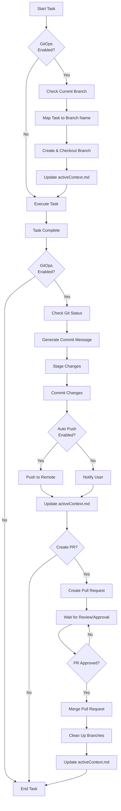

# **Cline Recursive Chain-of-Thought System (CRCT) - GitOps Plugin**

**This Plugin provides detailed instructions and procedures for integrating GitOps practices into the CRCT system workflow. It should be used in conjunction with the Core System Prompt and other phase plugins.**

---

## I. GitOps Integration Overview

**Purpose**: The GitOps plugin extends the CRCT system with version control best practices, ensuring that all code changes are properly tracked, reviewed, and integrated through a structured Git workflow.

**Key Benefits**:
1. **Traceability**: Every change is tracked with meaningful commit messages and branch names.
2. **Isolation**: Each task is developed in its own feature branch, preventing conflicts.
3. **Review Process**: Changes can be reviewed through pull requests before integration.
4. **Automation**: Standardized branch naming and commit message formats enable automation.
5. **Rollback Capability**: Clean Git history allows for easy rollback if needed.

**Integration Points**:
- **Strategy Phase**: Branch creation for planning tasks.
- **Execution Phase**: Branch creation, commits, and pushes for implementation tasks.
- **Cleanup/Consolidation Phase**: Final commits, pull request creation, and branch cleanup.

---

## II. Configuration

**Action**: Configure the GitOps workflow in `.clinerules`.

**Configuration Structure**:
```
[GITOPS_WORKFLOW]
enabled: true
default_base_branch: dev
branch_naming_convention: conventional_commits
remote_name: origin
auto_push: true
task_to_branch_mapping:
  Strategy_*: "chore/{task-name}"
  Execution_feat_*: "feat/{task-name}"
  Execution_fix_*: "fix/{task-name}"
  Execution_refactor_*: "refactor/{task-name}"
  Execution_test_*: "test/{task-name}"
  Execution_docs_*: "docs/{task-name}"
  Execution_style_*: "style/{task-name}"
  Execution_perf_*: "perf/{task-name}"
  Execution_chore_*: "chore/{task-name}"
  Execution_*: "feat/{task-name}"  # Default for other Execution tasks
```

**Configuration Parameters**:
- **enabled**: Boolean flag to enable/disable GitOps workflow.
- **default_base_branch**: The branch to use as the base for new feature branches (typically `dev` or `main`).
- **branch_naming_convention**: The convention to use for branch names (e.g., `conventional_commits`).
- **remote_name**: The name of the remote repository (typically `origin`).
- **auto_push**: Boolean flag to enable/disable automatic pushing of commits to the remote repository.
- **task_to_branch_mapping**: Mapping of task name patterns to branch name prefixes.

---

## III. Pre-Task GitOps Operations

**Action**: Set up the Git environment before task execution.

**Procedure**:
1. **Check GitOps Configuration**:
   - Read the `[GITOPS_WORKFLOW]` section in `.clinerules`.
   - If `enabled` is not `true`, skip GitOps workflow.
   - If `enabled` is `true`, proceed with setup.

2. **Verify Current Git Branch**:
   - Execute `git branch --show-current` to determine the current branch.
   - If the current branch is not the `default_base_branch` (e.g., `dev`):
     - Inform the user and ask if they want to proceed from the current branch or switch to the default branch.
     - If the user wants to switch, execute `git checkout {default_base_branch}`.

3. **Map Task Name to Branch Name**:
   - Extract the task name from the task file (e.g., `Execution_{task_name}.md` or `Strategy_{task_name}.md`).
   - Apply the mapping rules from `task_to_branch_mapping` in `.clinerules` to determine the appropriate branch name.
   - For example, if the task is `Execution_feat_user_auth.md`, and the mapping rule is `Execution_feat_*: "feat/{task-name}"`, the branch name would be `feat/user-auth`.
   - If no specific mapping rule matches, use the default mapping (typically `Execution_*: "feat/{task-name}"`).
   - State: "Mapping task `{task_file}.md` to branch name `{branch_name}` based on GitOps configuration."

4. **Create and Checkout Working Branch**:
   - Execute `git checkout -b {branch_name}` to create and switch to the new branch.
   - State: "Created and checked out new branch `{branch_name}` for task execution."

5. **Update `activeContext.md`**:
   - Add information about the GitOps workflow setup to `activeContext.md`, including:
     - The task being executed
     - The base branch (e.g., `dev`)
     - The working branch created (e.g., `feat/user-auth`)
     - The timestamp of branch creation
   - State: "Updated `activeContext.md` with GitOps workflow information."

---

## IV. Post-Task GitOps Operations

**Action**: Perform Git operations after task completion to commit and push changes.

**Procedure**:
1. **Check GitOps Configuration**:
   - Read the `[GITOPS_WORKFLOW]` section in `.clinerules` to determine if GitOps workflow is enabled and if `auto_push` is set to `true`.
   - If `enabled` is not `true`, skip this section.
   - If `enabled` is `true`, continue with the GitOps post-task operations.

2. **Check Git Status**:
   - Execute `git status` to see what files have been modified, added, or deleted.
   - State: "Checking Git status to identify changes made during task execution."
   - Analyze the output to identify the files that were modified as part of the task execution.

3. **Generate Commit Message**:
   - Based on the task name and the changes made, generate a meaningful commit message following the Conventional Commits specification.
   - The commit message should have:
     - A type prefix (e.g., `feat:`, `fix:`, `docs:`, `refactor:`, etc.) derived from the branch name or task type
     - A concise summary of the changes
     - A more detailed description in the commit body if necessary
   - Example: For a task named `Execution_feat_user_auth.md` that implemented user authentication:
     ```
     feat: implement user authentication system
     
     - Add login and registration endpoints
     - Create user model with password hashing
     - Implement JWT token generation and validation
     ```
   - State: "Generated commit message based on task and changes."

4. **Stage Changes**:
   - Execute `git add .` to stage all changes.
   - Alternatively, if more selective staging is required, execute `git add {file1} {file2} ...` for specific files.
   - State: "Staged changes for commit."

5. **Commit Changes**:
   - Execute `git commit -m "{commit_message}"` to commit the staged changes.
   - If a multi-line commit message is used, execute:
     ```
     git commit -m "{commit_message_title}" -m "{commit_message_body}"
     ```
   - State: "Committed changes with message: `{commit_message}`."

6. **Push Changes (If Configured)**:
   - If `auto_push` is set to `true` in the GitOps configuration:
     - Execute `git push -u {remote_name} {branch_name}` to push the changes to the remote repository.
     - State: "Pushed changes to remote repository `{remote_name}` on branch `{branch_name}`."
   - If `auto_push` is not set to `true`:
     - Inform the user that changes have been committed but not pushed.
     - Provide the command they can use to push the changes manually.
     - State: "Changes have been committed but not pushed. To push manually, use: `git push -u {remote_name} {branch_name}`."

7. **Update `activeContext.md`**:
   - Add information about the GitOps post-task operations to `activeContext.md`, including:
     - The files that were modified
     - The commit message
     - Whether the changes were pushed to the remote repository
     - The timestamp of the commit/push
   - State: "Updated `activeContext.md` with GitOps post-task operation information."

---

## V. Pull Request Creation and Management

**Action**: Create and manage pull requests for completed tasks.

**Procedure**:
1. **Check if Pull Request Creation is Needed**:
   - If the task is complete and changes have been pushed to the remote repository, a pull request may be needed to merge the changes into the base branch.
   - This is typically done during the Cleanup/Consolidation phase or at the end of a significant task.

2. **Create Pull Request**:
   - If the repository is hosted on GitHub, GitLab, or a similar platform, use the appropriate command or API to create a pull request.
   - For GitHub, you can use the GitHub CLI:
     ```
     gh pr create --base {default_base_branch} --head {branch_name} --title "{commit_message_title}" --body "{commit_message_body}"
     ```
   - Alternatively, provide instructions for the user to create the pull request manually through the web interface.
   - State: "Created pull request for branch `{branch_name}` to be merged into `{default_base_branch}`."

3. **Wait for Review and Approval**:
   - Pull requests typically require review and approval before they can be merged.
   - This is an asynchronous process that may involve other team members.
   - The CRCT system should continue with other tasks while waiting for the pull request to be reviewed and approved.

4. **Check Pull Request Status**:
   - Periodically check the status of open pull requests.
   - For GitHub, you can use:
     ```
     gh pr list --state open
     ```
   - State: "Checking status of open pull requests."

5. **Merge Pull Request (If Approved)**:
   - If a pull request has been approved, it can be merged into the base branch.
   - For GitHub, you can use:
     ```
     gh pr merge {pr_number} --merge
     ```
   - State: "Merged pull request #{pr_number} into `{default_base_branch}`."

6. **Clean Up Branches**:
   - After a pull request has been merged, the feature branch can be deleted.
   - Execute:
     ```
     git checkout {default_base_branch}
     git pull
     git branch -d {branch_name}
     git push {remote_name} --delete {branch_name}
     ```
   - State: "Cleaned up branch `{branch_name}` after successful merge."

7. **Update `activeContext.md`**:
   - Add information about the pull request and merge to `activeContext.md`, including:
     - The pull request number
     - The merge status
     - The timestamp of the merge
   - State: "Updated `activeContext.md` with pull request and merge information."

---

## VI. GitOps Workflow Diagram



---

## VII. Integration with Task Initiation

**Action**: Provide user-friendly options for GitOps operations at task initiation.

**Procedure**:
1. **Task Initiation UI Integration**:
   - When a new task is initiated, the system should present GitOps-related options to the user.
   - These options should appear as interactive elements (e.g., buttons) at the beginning of the task.

2. **GitOps Operation Options**:
   - **"Create New Branch for Task"**: Executes the Pre-Task GitOps Operations (Section III).
   - **"Use Current Branch"**: Skips branch creation and uses the current branch.
   - **"Cancel"**: Cancels the task initiation.

3. **Implementation Approach**:
   ```
   # When a new task is initiated
   
   [New task detected: Execution_feat_user_auth.md]
   - Current branch: dev
   - Suggested branch name: feat/user-auth
   
   Would you like to:
   1. Create new branch 'feat/user-auth' for this task
   2. Use current branch 'dev'
   3. Cancel
   ```

4. **Command Execution on Selection**:
   - If the user selects "Create new branch for this task", the system should execute:
     ```
     git checkout -b feat/user-auth
     ```
   - After execution, confirm success and update `activeContext.md` with branch information.

5. **Error Handling**:
   - If branch creation fails, provide clear error messages and recovery options.
   - Common issues include branch already exists, permission problems, or network errors.
   - Offer guidance on resolving these issues.

6. **Integration with Task Instructions**:
   - Update the task instruction file to include information about the branch being used.
   - This helps maintain context about which branch is associated with which task.

---

## VIII. Integration with Other Phases

**Strategy Phase Integration**:
- During the Strategy phase, GitOps operations can be used to create branches for planning tasks.
- This helps keep planning changes separate from implementation changes.
- Typical branch naming for Strategy tasks: `chore/plan-{feature-name}`.
- Present branch creation options at the beginning of Strategy tasks.

**Execution Phase Integration**:
- During the Execution phase, GitOps operations are used for all implementation tasks.
- Each task gets its own branch, with naming based on the task type (feat, fix, refactor, etc.).
- Present branch creation options at the beginning of Execution tasks.
- Present commit and push options at the end of Execution tasks.

**Cleanup/Consolidation Phase Integration**:
- During the Cleanup/Consolidation phase, GitOps operations are used to finalize changes.
- This includes creating pull requests, merging approved changes, and cleaning up branches.
- Final documentation updates and version bumps are also committed during this phase.
- Present pull request creation options at the end of Cleanup/Consolidation tasks.

---

## IX. Integration with Task Completion

**Action**: Provide user-friendly options for GitOps operations at task completion.

**Procedure**:
1. **Task Completion UI Integration**:
   - When a task is complete and `attempt_completion` is used, the system should present GitOps-related options to the user.
   - These options should appear as interactive elements (e.g., buttons) alongside the standard "Start New Task" option.

2. **GitOps Operation Options**:
   - **"Git Commit and Push Branch"**: Executes the Post-Task GitOps Operations (Section IV).
   - **"Cancel"**: Skips GitOps operations for now.

3. **Implementation Approach**:
   ```
   <attempt_completion>
   <result>
   Implemented user authentication system with login endpoint and user model.
   
   [Git operations are pending for this task]
   - Current branch: feat/user-auth
   - Modified files: 3
   - Suggested commit message: "feat: implement user authentication system"
   
   Would you like to:
   1. Commit and push changes to branch
   2. Skip git operations for now
   </result>
   </attempt_completion>
   ```

4. **Command Execution on Selection**:
   - If the user selects "Commit and push changes to branch", the system should execute:
     ```
     git add .
     git commit -m "feat: implement user authentication system" -m "- Add login endpoint\n- Create user model"
     git push -u origin feat/user-auth
     ```
   - After execution, confirm success and provide options to create a pull request if appropriate.

5. **Error Handling**:
   - If git operations fail, provide clear error messages and recovery options.
   - Common issues include merge conflicts, permission problems, or network errors.
   - Offer guidance on resolving these issues.

6. **Pull Request Creation Option**:
   - After successful commit and push, offer an option to create a pull request.
   - If selected, execute:
     ```
     gh pr create --base dev --head feat/user-auth --title "feat: implement user authentication system" --body "- Add login endpoint\n- Create user model"
     ```
   - Provide the pull request URL in the response.

---

## X. Quick Reference

- **Objective**: Integrate GitOps practices into the CRCT system workflow to ensure proper version control and code review.
- **Key Actions**:
  - **Pre-Task**:
    - Check GitOps configuration
    - Verify current branch
    - Map task to branch name
    - Create and checkout branch
    - Update `activeContext.md`
  - **Post-Task**:
    - Check Git status
    - Generate commit message
    - Stage and commit changes
    - Push to remote (if configured)
    - Update `activeContext.md`
  - **Pull Request**:
    - Create pull request
    - Wait for review/approval
    - Merge pull request
    - Clean up branches
    - Update `activeContext.md`
  - **Task Completion**:
    - Perform GitOps operations before using `attempt_completion`
    - Include GitOps status in completion report
- **Key Inputs**: Task name, GitOps configuration, Git status.
- **Key Outputs**: Git branches, commits, pull requests, merged changes.
- **Integration Points**: Strategy phase, Execution phase, Cleanup/Consolidation phase, Task completion.
