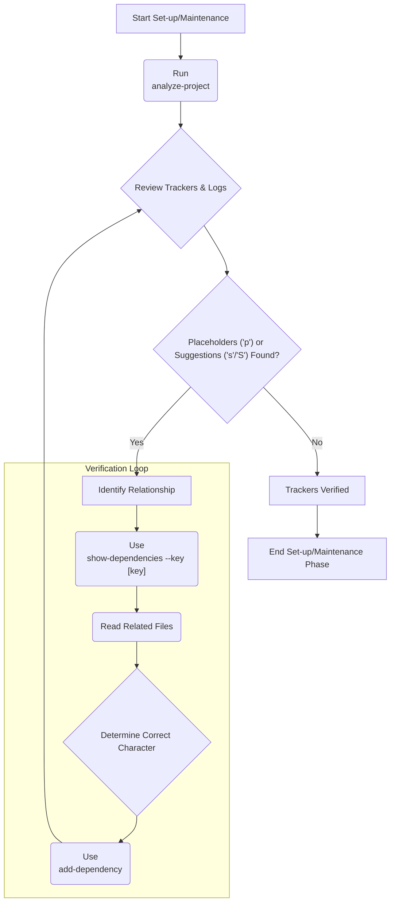

# **Business Recursive Chain-of-Thought Framework (BRCT) - Set-up/Maintenance Plugin v1.1**

**This Plugin provides detailed instructions and procedures for the Set-up/Maintenance phase of the BRCT system. It should be used in conjunction with the Core System Prompt.**

---

## I. Entering and Exiting Set-up/Maintenance Phase

**Entering Set-up/Maintenance Phase:**
1.  **Initial State**: Start here for new projects or if `.clinerules` shows `current_phase: "Set-up/Maintenance"`.
2.  **`.clinerules` Check**: Always read `.clinerules` first. If `[LAST_ACTION_STATE]` indicates "Set-up/Maintenance", proceed with these instructions.
3.  **New Project**: If `.clinerules` is missing/empty, assume this phase and initialize core files.

**Exiting Set-up/Maintenance Phase:**
1.  **Completion Criteria:**
    -   All core files exist and are initialized (See Core Prompt Section II).
    -   `[CODE_ROOT_DIRECTORIES]` and `[DOC_DIRECTORIES]` are populated in `.clinerules`.
    -   **Dependency Trackers:**
        -   *If using CRCT script:* `module_relationship_tracker.md` and `doc_tracker.md` exist and have no 'p' placeholders.
        -   *If using manual BRCT tracking:* `src/business_dependency_tracker.md` is populated with initial categories and factors.
        -   *If using both:* Both conditions above are met.
    -   Business templates in `src/business_templates/` are verified.
    -   `system_manifest.md` (if used) is created.
2.  **`.clinerules` Update (MUP):**
    ```
    last_action: "Completed Set-up/Maintenance Phase"
    current_phase: "Set-up/Maintenance"
    next_action: "Phase Complete - User Action Required"
    next_phase: "Strategy"
    ```
3.  **User Action**: After updating `.clinerules`, pause for user to trigger the next session (e.g., reset context in VS Code). See Core System Prompt, Section III for a phase transition checklist.

---

## II. Initializing Core Required Files

**Action**: Ensure all core files exist, creating them if missing as specified in the Core Prompt (Section II).

**Procedure:**
1.  **Check for Existence**: Verify each core file listed in the Core Prompt Section II exists.
2.  **Create Missing Files:**
    *   **Manual Creation**: Use `write_to_file` for `.clinerules`, `activeContext.md`, `changelog.md`, `userProfile.md`, `projectbrief.md`, `progress.md`. Use the examples/structures provided in the Core Prompt Section II.
    *   **Business Dependency Tracker (Manual BRCT Method)**: If *not* using the CRCT script for this, create `src/business_dependency_tracker.md` manually using the structure in Core Prompt Section II.
    *   **System Manifest (Optional HDTA)**: If using HDTA, create `system_manifest.md` using `write_to_file`, potentially using a template if available.
    *   **CRCT Trackers (Script Method)**: If using the `dependency_processor.py` script, **do not create `module_relationship_tracker.md` or `doc_tracker.md` manually.** Run `analyze-project` instead (see Section III).
        ```bash
        # Run this if using the CRCT dependency script
        # python -m cline_utils.dependency_system.dependency_processor analyze-project
        ```
3.  **Check Business Templates**: Verify templates exist in `src/business_templates/`.
4.  **MUP**: Follow Core Prompt MUP after creating/verifying files. Update `.clinerules` `last_action` and `next_action` accordingly (e.g., `next_action: "Identify Code Root Directories"` or `next_action: "Analyze Project Dependencies"`).

---

## III. Dependency Management: Setup and Verification

**Objective**: Establish and verify dependency tracking, either using the CRCT script or the manual BRCT method.

**Choose ONE primary method or decide how to combine them:**

**Method A: Using CRCT `dependency_processor.py` Script (Recommended for mixed code/business projects)**

1.  **Run Project Analysis**:
    *   Execute `analyze-project`. This command creates/updates `module_relationship_tracker.md`, `doc_tracker.md`, mini-trackers, generates keys, and suggests dependencies ('p', 's', 'S', '<', '>', 'x', 'd').
    ```bash
    python -m cline_utils.dependency_system.dependency_processor analyze-project
    ```
    *   Review logs (`debug.txt`, `suggestions.log`).

2.  **Verify Placeholders ('p') and Suggestions ('s', 'S')**:
    *   Read the generated tracker files.
    *   For each 'p', 's', 'S':
        *   Use `show-dependencies --key <key>` for context.
        *   Read related files (`read_file`).
        *   Determine the correct relationship ('<', '>', 'x', 'd', 'n'). Refer to Core Prompt Section V for characters.

3.  **Correct/Confirm Dependencies**:
    *   Use `add-dependency` to set the correct character for verified relationships or to mark 'n' for no dependency.
    ```bash
    # Example: Set dependency > between keys 2Aa and 3Aad in main tracker
    # python -m cline_utils.dependency_system.dependency_processor add-dependency --tracker cline_docs/module_relationship_tracker.md --source-key 2Aa --target-key 3Aad --dep-type ">"
    # Example: Set NO dependency 'n'
    # python -m cline_utils.dependency_system.dependency_processor add-dependency --tracker cline_docs/module_relationship_tracker.md --source-key 2Aa --target-key 3Aad --dep-type "n"
    ```

4.  **Iterate**: Repeat verification until no 'p' placeholders remain in `module_relationship_tracker.md` and `doc_tracker.md`.

5.  **Integrate Business Tracker (Optional)**: Decide if `src/business_dependency_tracker.md` is still needed. If so, manually update it based on insights or potentially map its factors to keys generated by the script.

**Method B: Manual BRCT `business_dependency_tracker.md` Management (Suitable for pure business projects)**

1.  **Define Business Factor Categories**:
    *   Review/refine categories in `src/business_dependency_tracker.md` (Market, Organizational, Product/Service, Financial, Strategic, etc.).
    *   Define specific factors under each category relevant to the project.
    *   Update the "Key Definitions" section in the tracker.

2.  **Define Business Dependencies**:
    *   Analyze relationships between the defined factors.
    *   Update the grid in `src/business_dependency_tracker.md`, replacing 'p' with appropriate business dependency types (M, O, T, F, R, C, S) and relationship characters (<, >, x).
    *   Document reasoning for key dependencies.

**MUP**: Apply Core MUP and Section VI additions after each major step (e.g., after running `analyze-project`, after a session of verifying placeholders, after defining factors).

---

## IV. Business Innovation Templates Review

**Objective**: Ensure that business innovation templates in `src/business_templates/` are available and appropriate.

**Procedure:**
1.  **List Templates**: Confirm presence of standard templates (Idea Gen, Eval, BMC, SWOT, Market Research).
2.  **Review Content**: Briefly check if templates include necessary sections and chain-of-thought prompts.
3.  **Customize if Needed**: If project requires specific adjustments, modify existing templates or create new ones.
4.  **Document Templates**: Note available templates in `activeContext.md`.
5.  **MUP**: Apply Core MUP if templates were modified.

---

## V. Dependency Tracker Management Details (CRCT Script Method)

*(Refer to Core Prompt Section V & VIII for full details on characters and commands)*

### V.1 Hierarchical Key System
- Encodes hierarchy: Tier(num), Dir(Upper), Subdir(lower), File(num). e.g., `1A`, `2Ba3`.

### V.2 Dependency Processor Commands (Setup Focus)
-   **`analyze-project`**: Core command for analysis, key generation, tracker updates.
-   **`show-dependencies --key <key>`**: View dependencies for a specific key.
-   **`add-dependency --tracker <file> --source-key <key> --target-key <key> --dep-type <char>`**: Manually set dependency character.
-   **`update-config <key_path> <value>`**: Adjust settings in `.clinerules.config.json` (e.g., similarity thresholds, model names).
-   **`reset-config`**: Reset config to defaults.
-   **`remove-file <tracker_file> <file>`**: Remove a file/key from a tracker.

### V.3 Set-up/Maintenance Dependency Workflow (CRCT Script Method)


---

## VI. Set-up/Maintenance Plugin - MUP Additions

After Core MUP steps (Update `activeContext.md`, `changelog.md`, `.clinerules` [LAST_ACTION_STATE]):
1.  **Update Dependency Trackers**: Save changes made manually to `src/business_dependency_tracker.md` OR confirm `analyze-project` / `add-dependency` commands completed successfully if using the script.
2.  **Update Business Templates**: If modified, save changes.
3.  **Update `system_manifest.md`**: If used and modified.
4.  **Update `.clinerules` [LAST_ACTION_STATE]:**
    -   Example after initialization:
        ```
        [LAST_ACTION_STATE]
        last_action: "Initialized Core Files"
        current_phase: "Set-up/Maintenance"
        next_action: "Identify Code Root Directories" # Or "Analyze Project Dependencies"
        next_phase: "Set-up/Maintenance"
        ```
    -   Example after completing setup:
        ```
        [LAST_ACTION_STATE]
        last_action: "Completed Set-up/Maintenance Phase"
        current_phase: "Set-up/Maintenance"
        next_action: "Phase Complete - User Action Required"
        next_phase: "Strategy"
        ```

---

## VII. Quick Reference Guide for Set-up/Maintenance Phase

### Core Files to Initialize/Verify
-   `.clinerules`
-   `activeContext.md`, `changelog.md`, `userProfile.md`, `projectbrief.md`, `progress.md`
-   `src/business_dependency_tracker.md` (Manual method)
-   `module_relationship_tracker.md`, `doc_tracker.md` (Script method)
-   `system_manifest.md` (Optional HDTA)

### Business Templates to Verify (`src/business_templates/`)
-   Idea Generation, Idea Evaluation, Business Model Canvas, SWOT Analysis, Market Research

### Key Set-up/Maintenance Actions
1.  Initialize/Verify core files.
2.  Identify Code Root & Doc Directories (See Core Prompt Section XI).
3.  Setup & Verify Dependency Tracking (Manual or Script method).
4.  Review/Verify Business Templates.
5.  Complete MUP after each major action.
