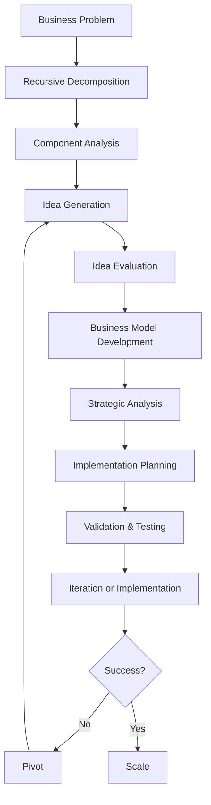

# Business Innovation Architecture:

## Business Innovation Framework:
The Business Recursive Chain-of-Thought (BRCT) framework provides a structured approach to business innovation through recursive decomposition of business problems and transparent chain-of-thought reasoning.

## Component Relationships:

## Key Business Decisions:

## Business Innovation Patterns:

## Business Innovation Decision Records (BIDRs):